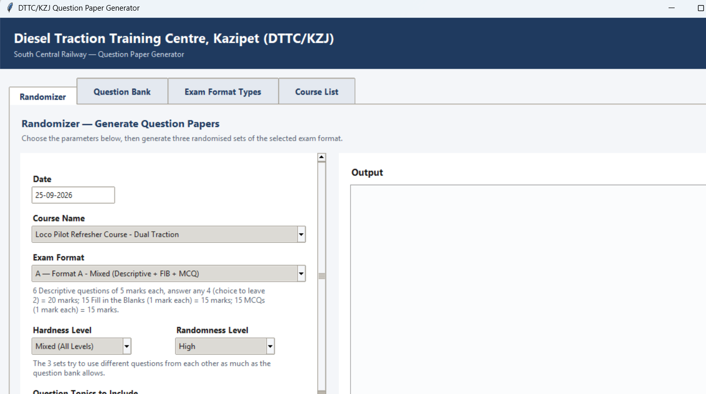

# DTTC/KZJ Question Paper Generator

A desktop app that generates randomised question papers (Word & PDF) for
railway training centres, built for the **Diesel Traction Training Centre,
Kazipet (DTTC/KZJ), South Central Railway** — and reusable as-is for any
similar training centre (ETTC, RRC, etc.), since courses, topics, exam
formats and the entire question bank are fully user-editable from within
the app.

Open source under the [MIT License](LICENSE) — use it, fork it, adapt it
for your own centre.



## Features

- **Randomizer** — pick a Date (calendar popup), Exam Duration (hours/minutes
  dropdowns), Course, Exam Format, Hardness Level, Randomness Level and
  Topics, then generate **1, 2 or 3 randomised sets** of a question paper
  as Word (`.docx`) and/or PDF, plus an optional answer key per set. Papers
  carry blank Batch No / Name / Design / Depo-divn fields for candidates.
  Optional **topic weightage**: give each ticked topic a percentage (total 100%)
  to control how many questions come from each topic.
- **Question Bank** — full CRUD for MCQ, Fill-in-the-Blank and Descriptive
  questions, plus the Topics used to tag them. Select several questions
  (Ctrl/Shift+click, Ctrl+A) to delete them in one go. Import/export any of
  it as CSV or Excel for bulk editing; imported questions always get the
  next free IDs automatically, whether or not the file has an ID column.
- **Exam Format Types** — define paper layouts yourself: how many questions
  of each type, marks each, and "answer any N of M" choice (e.g. 6
  descriptive questions worth 5 marks, answer any 4).
- **Course List** — manage the list of courses offered by the centre.
- **Single JSON data file** (`data/dttc_data.json`) that lives next to the
  app, not inside it — easy to back up, version, or move between machines.
- No external services, no internet connection required, no database to
  set up.

## Requirements

- **To run from source:** Python 3.9+ (tested on 3.11), pip.
- **To just use the app:** nothing — download the prebuilt Windows `.exe`
  from the [Releases](../../releases) page and double-click it. No Python
  needed.

---

## Option A — Run from source (`main.py`)

For development, or if you're not on Windows (the packaged `.exe` is
Windows-only; running from source works on Windows/macOS/Linux since it's
plain Tkinter + pure-Python libraries).

```bash
git clone https://github.com/Hyderbaigg2/dttc_ettc_qp_generator.git
cd dttc_ettc_qp_generator
pip install -r requirements.txt
python main.py
```

That's it — the app window opens, and `data/dttc_data.json` (already
included in this repo, seeded with sample courses/topics/formats/questions)
is loaded automatically.

## Option B — Use the prebuilt Windows package

1. Go to the [Releases](../../releases) page and download the latest
   `DTTC_QuestionPaperApp.zip`.
2. Unzip it anywhere — you'll get a folder containing:
   ```
   DTTC_QuestionPaperApp.exe
   data/
       dttc_data.json
   ```
3. Double-click `DTTC_QuestionPaperApp.exe`. No installation, no Python.

**Keep `DTTC_QuestionPaperApp.exe` and the `data` folder together, in the
same folder, at all times.** The `data` folder holds every course, topic,
format and question — the app reads and auto-saves to it on every change.
If you move the `.exe` on its own without `data` next to it, the app starts
with an empty question bank.

To move the app to another PC, copy the *whole folder* (exe + `data`
together), not just the `.exe`.

First-run notes (no code signing certificate is used for this project, so
these are expected and harmless):
- Windows SmartScreen may show "Windows protected your PC" the first time —
  click **More info** → **Run anyway**.
- Antivirus software may scan or flag it briefly on first launch, since
  it's a new/unrecognised executable — allow it if prompted.
- The first launch can take 5–10 seconds (the app unpacks itself into
  memory); subsequent launches are fast.

### Building the `.exe` yourself

If you'd rather build it from source than trust a downloaded binary:

```bash
pip install -r requirements.txt
pyinstaller --noconsole --onefile --name "DTTC_QuestionPaperApp" main.py
```

The `.exe` will be in `dist/`. Copy the `data` folder next to it — PyInstaller
intentionally does **not** bundle `data/` into the `.exe`, so the question
bank stays editable without rebuilding the app.

---

## How it works

Everything — courses, topics, exam formats, and every MCQ/Fill-in-the-Blank/
Descriptive question — lives in one file: `data/dttc_data.json`, next to the
app (never inside a bundled package). Every add/edit/delete in the UI
auto-saves immediately and atomically (write-to-temp-file-then-replace, so a
crash mid-save can't corrupt your data).

Import/export (CSV or Excel) is available from the Question Bank, Course
List and Topics screens for bulk editing. Questions whose answer isn't known yet can be stored with the answer `NIL`
(a blank answer in an imported file becomes `NIL`); fill it in later with Edit.

Imports always create **new**
rows — any ID column in the file is ignored, so imported items get fresh
IDs and can't collide with existing ones.

### Randomness Level, explained

- **Low** — all 3 sets use the same questions, just reshuffled in order
  (and MCQ options reshuffled). Good for controlled retests where the sets
  should be equivalent.
- **Medium** — each set keeps roughly half of the previous set's questions
  and swaps in fresh ones where the bank allows.
- **High** (default) — the 3 sets try to use different questions from each
  other as much as the question bank allows, only repeating when the pool
  is too small.

If the filtered question bank (after Hardness Level / Topic filters) can't
satisfy the selected format, generation is blocked with a message stating
exactly how many more questions of which type are needed — no paper is
ever generated with a silent shortfall.

## Project structure

```
main.py                 Entry point
app/
  data_manager.py        JSON load/save + CRUD for courses/topics/formats/questions
  generator.py            Randomisation engine (the multi-set sampling logic)
  docx_export.py           Word (.docx) paper + answer key rendering
  pdf_export.py             PDF paper + answer key rendering (reportlab, no MS Word needed)
  csv_io.py                  CSV/Excel import & export
  paths.py                    Resolves data/output folders next to the exe or script
  ui/                          Tkinter UI: theme, main window, the 4 tabs, dialogs
data/dttc_data.json      The single data store (seeded with sample content)
requirements.txt
```

## Contributing

Issues and pull requests are welcome — this was built for one training
centre's workflow, so if you adapt it for a different centre or exam
structure, contributions that make it more general-purpose are especially
appreciated.

## License

[MIT](LICENSE) — © 2026 Hyder Baig. Do what you like with it; keep the
copyright notice.
